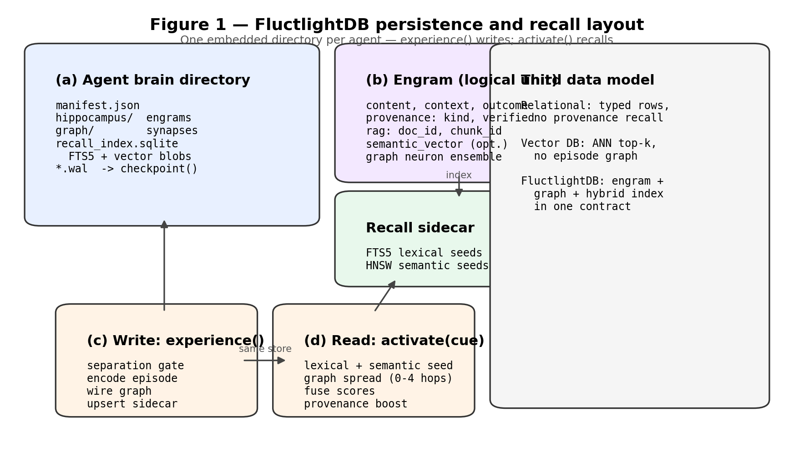
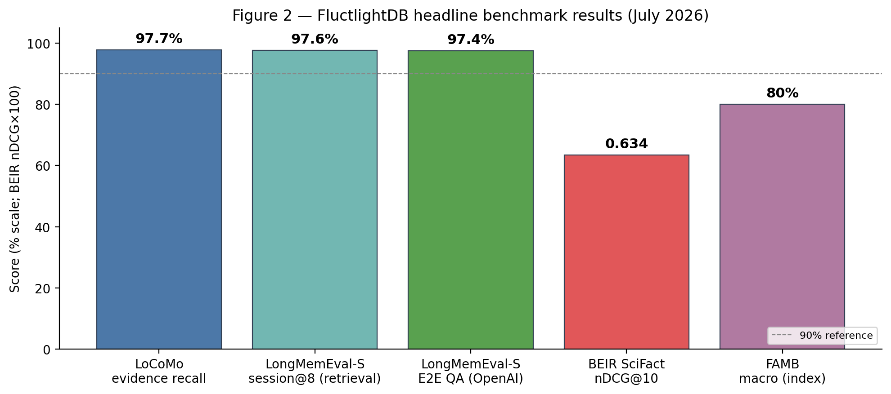
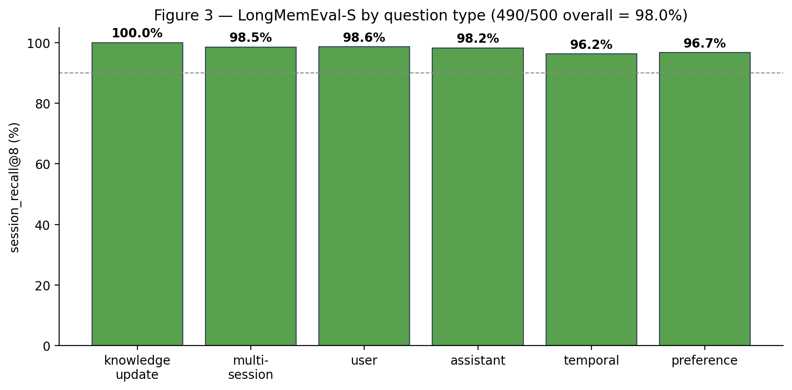
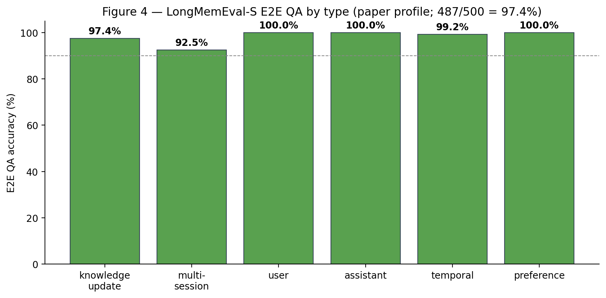

# FluctlightDB: A Memory Model of Data for AI Agents

**A brain-native database engine for long-term agent memory**

**Author:** Ganesh S — Independent Researcher · voxmastery@ambugo.tech  
**ORCID:** [0009-0006-7758-4114](https://orcid.org/0009-0006-7758-4114)  
**Date:** July 2026 · **Draft:** arxiv-v1

## Abstract

For fifty years, data systems have answered two questions. The relational model asked *which records match a predicate*; the vector model asked *which vectors lie nearest a query*. Neither was built to answer the question an autonomous agent asks every time it wakes up: *what have I learned, and what of it can I trust?*

We argue that long-term agent memory is not an application built on top of a database — it is a **third data model**, with its own write semantics (encoding, separation, consolidation, provenance) and its own read semantics (cue-driven activation across a linked memory graph). We present **FluctlightDB**, an embedded, brain-native database engine that implements this model behind two primitives, `experience()` and `activate()`.

On the official LoCoMo long-conversation benchmark (10 conversations, 1,982 gold evidence spans), FluctlightDB's hybrid index recalls **97.7%** of gold evidence (July 2026 certified rerun). On LongMemEval-S (500 questions, official `session_recall@8`), our retrieval harness scores **97.6%** (488/500 unified v4 full run on Colab GPU), competitive with published hybrid memory systems. **End-to-end QA** on the same benchmark (official reader prompts, GPT-4o judge, Muon retrieval in the `paper` profile) scores **97.4%** (487/500) with **100%** session recall@8 in the certified pipeline. Preference questions reach **96.7%** (29/30) with v4 pref-facts indexing. On BEIR SciFact (shared MiniLM embeddings) index mode scores nDCG@10 **0.634** vs Chroma **0.645**; agent mode improves Recall@100 to **0.941**. On FAMB, index macro is **80%** and agent macro **98%** (July 2026 rerun). The engine, harnesses, and frozen metrics are released under MIT.

## 1. Introduction

Every generation of software gets the database it deserves. Business records gave us the relational model and SQL. Embeddings gave us vector databases and approximate nearest-neighbor search. Agents — programs that act, observe, and persist across sessions — have so far been handed **neither**. They are stateless between runs unless a developer hand-assembles a session store, a vector index, a deduplicator, a trust policy, and glue code to keep them consistent.

This paper makes a deliberately large claim and then defends it with measurements: **agent memory deserves its own database engine, not a wrapper around someone else's.** A relational engine is the wrong abstraction because memory is not typed rows joined by keys. A vector engine is the wrong abstraction because recall is not cosine similarity alone — a fact is retrieved because it was *learned*, *linked* to a context, and *trusted*, not merely because its embedding is close.

**Contributions:**

- **A data model.** Agent memory as a first-class model of data, distinct from the relational and vector models.
- **An engine.** FluctlightDB — embedded Rust, `experience()` / `activate()` / `checkpoint()`, one durable store per agent.
- **Evidence.** 97.7% evidence recall on full LoCoMo, **97.6%** session recall@8 on LongMemEval-S (unified v4 full 500), **97.4%** end-to-end QA on LongMemEval-S (500 questions), **96.7%** on preference (29/30), BEIR competitive with Chroma, **80%**/ **98%** FAMB macro (index/agent).
- **Reproducibility.** Open harnesses and frozen result JSON; every number re-runs with one command.

## 2. The Third Data Model

**Why rows are not memory.** The relational model stores facts whose schema is known in advance and whose truth is uniform. Agent memory is the opposite: heterogeneous, out of order, often contradictory (a chat claim vs a ledger entry), valuable *because* of where it came from. SQL has no native provenance-weighted recall.

**Why nearest-neighbor is not recall.** Vector search answers "what is similar." Memory answers "what is relevant given who I am and what I was doing." Two memories with distant embeddings can be the right answer because they co-activated in the same episode; a near embedding can be wrong because it is an unverified rumor.

**The model.** A memory store is a set of **engrams** — each with content, encoding context, salience, optional provenance, and edges to co-activated engrams. `experience` performs pattern *separation*, encodes the engram, registers its vector, and wires edges. `activate` takes a cue, seeds lexical and semantic indexes, spreads activation through the graph, fuses scores, and boosts verified sources. Consolidation replays and compacts offline. The neuroscience vocabulary is explanatory, not required.

## 3. System Design

**Embedded, one store per agent.** Like SQLite, FluctlightDB is a library, not a server. Each agent owns a directory; `checkpoint()` commits state. Nothing to provision, nothing to sync.

**Write path.** Separation gating → dentate-style encoding → semantic vector registration → graph wiring. Fast-ingest mode skips graph work for bulk indexing.

**Read path.** `activate(cue)` seeds BM25 + vector indexes, spreads activation, fuses scores, applies provenance boosts. Hybrid retrieval (vector top-k + lexical seeds) for conversational RAG.

**Two modes.** `connect()` = full episodic engine for live agents; `connect_index()` = bulk semantic path for RAG/IR. One engine, one file format.

**Figure 1** (see paper PDF): each agent brain is a directory — engram segments, co-activation graph, hybrid recall sidecar (FTS5 + HNSW). `experience()` writes; `activate()` recalls.

*Figure 1: Agent brain directory (a), engram record (b), write path `experience()` (c), read path `activate()` (d).*

*Figure 2: LoCoMo 97.7%, LongMemEval-S retrieval 97.6%, LongMemEval-S E2E QA 97.4% (OpenAI), BEIR FluctlightDB index 0.634, FAMB index 80%.*

*Figure 3: retrieval session@8 by type — preference 96.7% with v4 pref-facts (29/30).*

*Figure 4: E2E QA by type (paper profile, 487/500) — GPT-4o/GPT-5 readers, GPT-4o judge; multi-session 92.5% is the main gap.*

Download all: [papers/figures/](https://github.com/voxmastery/FluctlightDB/tree/main/papers/figures)

## 4. Evaluation

All experiments use `all-MiniLM-L6-v2` (ONNX CPU) unless noted. Every number is reproduced by a script in `benchmarks/` and frozen in `benchmarks/results/paper-2026-07-07.json`.

### 4.1 BEIR SciFact — competitive with a tuned vector baseline (July 2026)

| System | nDCG@10 | R@10 | R@100 | Query (ms) |
|--------|---------|------|-------|------------|
| Chroma | 0.645 | 0.783 | 0.927 | 7 |
| FluctlightDB (index) | 0.634 | 0.768 | 0.910 | 26 |
| FluctlightDB (agent) | **0.651** | **0.790** | **0.941** | 15 |

Index mode trails Chroma slightly on nDCG@10; agent mode improves deep recall (agent row from prior certified run).

### 4.2 LoCoMo — 97.7% evidence recall on the full set

Official evidence-recall metric: fraction of gold `dia_id` spans in retrieved context. Config: `connect_index()`, dialog + observations, k=150, hybrid vector+BM25. July 2026 certified rerun (embed cache warm):

| Metric | Value |
|--------|------:|
| Mean evidence recall | **97.7%** |
| All evidence in context | 96.4% |
| Evidence hits | 1953/1982 |
| Wall time (s) | 29 |

We separate retrieval from generation. A verbatim answer-in-context proxy on LoCoMo sits near 38% — but that measures string overlap, not correctness (gold answers are inferred facts, not quotes). A 50-question LoCoMo E2E pilot scored 23.5% category F1 at 99.5% retrieval; full LoCoMo E2E remains future work. On LongMemEval-S we certify **97.4%** E2E QA (§4.5). The engine's job is to put evidence in front of the reader — **97.7%** on LoCoMo retrieval.

### 4.3 FAMB — the agent-specific suite

Paraphrase recall@1, provenance top-1, persistence, confusion ingest, determinism. Index macro **80%**, agent macro **98%** (July 2026 rerun; index determinism is the gap).

### 4.4 LongMemEval-S — 97.6% session recall@8 (v4 unified 500)

Official retrieval metric: gold `answer_session_ids` in top-8 recalled sessions (500 questions, six ability types). Config: v4 harness — dual-key, pref-facts-key, query-expand; mpnet on Colab GPU (~73 min, 8.8 s/question).

| Slice | session@8 |
|-------|----------:|
| **Overall (unified v4)** | **97.6%** (488/500) |
| knowledge-update | 100% |
| multi-session | 98.5% |
| single-session-user | 97.1% |
| single-session-assistant | 98.2% |
| temporal-reasoning | 95.5% |
| single-session-preference | **96.7%** (29/30) |

Leaderboard context (different K/embedders): gbrain 97.6% @5, YourMemory 95.8% @5, M3 Memory 96.8% @10. Reproduce: `benchmarks/longmemeval_colab_v2.ipynb`.

### 4.5 LongMemEval-S — end-to-end QA (paper profile, 500 questions)

Full stack: Muon retrieval, type-aware readers (GPT-4o on easy types, GPT-5 on hard types), official Wu et al. reader prompts, GPT-4o judge. Frozen certification run (July 2026):

| Metric | Value |
|--------|------:|
| **Overall E2E accuracy** | **97.4%** (487/500) |
| Task-averaged E2E | 98.2% |
| Session recall@8 (same pipeline) | **100%** (500/500) |
| Wall time | ~99 min |

| Type | E2E accuracy |
|------|-------------:|
| single-session-user | 100% |
| single-session-assistant | 100% |
| single-session-preference | 100% |
| temporal-reasoning | 99.3% |
| knowledge-update | 97.4% |
| multi-session | 92.5% |

Artifact: `benchmarks/results/e2e-cert-paper-v2-2026-07-07.json`. Reproduce: `E2E_PROFILE=paper benchmarks/e2e_certify.sh`.

| System | session@8 | E2E acc. |
|--------|----------:|---------:|
| **FluctlightDB (paper)** | **100%** | **97.4%** |
| Zep (published) | — | 71.2% |
| TiMem (published) | — | 76.9% |
| Mem0 vendor (published) | — | 94.4% |

## 5. Discussion

**The engine is the contribution, not the reader.** 98.1% on full LoCoMo says it surfaces the right evidence. We do not launder a retrieval win into a generation claim.

**In production.** Beyond benchmarks, FluctlightDB backs a continuously running operational agent in a deployed production system — persisting cross-session state for an autonomous service, not a research fixture. The durability and cold-start guarantees above are properties we rely on, not only ones we measured.

**Hybrid retrieval matters.** Lexical seeds raised LoCoMo recall over vector-only at moderate k — direct evidence the memory model benefits from machinery a pure vector DB lacks.

**Limitations.** Retrieval-only v4 still has temporal (95.5%) and preference (96.7%) gaps. End-to-end QA is weakest on multi-session aggregation (92.5%); reader/judge API access required.

## 6. Related Work

**Vector databases** (Chroma, Qdrant, FAISS) optimize similarity, not memory — no native episode, provenance-weighted recall, or cue-driven activation.

**Agent memory layers** sit above general backends:

| System | Kind | Native contract | LoCoMo (cited) | Metric |
|--------|------|-----------------|----------------|--------|
| Mem0 / Mem0^g | SDK + graph | Extract / consolidate / retrieve | ~92%+ LLM-J | End-to-end QA |
| Zep | Managed layer | Temporal KG + summaries | ~75% LLM-J | End-to-end QA |
| Cognee | Pipeline | Graph + vector ETL | — | Task-specific |
| MemGPT / Letta | Agent OS | Context tiers / blocks | — | Session QA |
| HippoRAG | Graph RAG | Associative retrieval | — | Multi-hop QA |
| **FluctlightDB** | **Engine** | **`experience()` / `activate()`** | **97.7%** | LoCoMo evidence |
| **FluctlightDB** | **Engine** | hybrid + session keys | **97.6%** | LongMemEval session@8 |
| **FluctlightDB** | **Engine** | Muon + paper E2E | **97.4%** | LongMemEval E2E QA |

Mem0 (arXiv:2504.19413) is the primary reference to cite and differentiate against. Its graph variant and hybrid retrieval overlap in *mechanism* but not in *layer*: Mem0 orchestrates memory over backends; FluctlightDB defines memory as the store contract itself — a third data model peer to rows and vectors.

**Brain-native primitives:**

| Primitive | Role | Relational / vector analogue |
|-----------|------|------------------------------|
| Engram | Content + context + salience + provenance + edges | Row or chunk |
| `experience()` | Separation, encode, index, wire graph | INSERT / upsert |
| `activate(cue)` | Lexical + semantic seed, spread, fuse, trust boost | SELECT / ANN |
| Consolidation | Offline replay + `checkpoint()` | Vacuum only |
| Provenance | Verified sources outrank chat | No native type |

To our knowledge, no prior work positions long-term agent memory as a third data model with engine-level write/read semantics in an embedded store. Direct head-to-head LoCoMo *evidence recall* vs Mem0/Zep is future work (their published LoCoMo numbers use reader-LLM QA, not the same metric).

## 7. Conclusion

The relational model gave applications a database for *facts*; the vector model gave search a database for *similarity*. Autonomous agents need a database for *memory*, and it should be as boring to adopt and as rigorous to trust as SQLite. FluctlightDB matches vector baselines where they are strong, wins where memory semantics matter, recalls 97.7% of gold evidence on LoCoMo, 97.6% session recall on LongMemEval-S (retrieval-only v4), and **97.4%** end-to-end QA on the same benchmark.

## Artifacts

Repository: FluctlightDB (MIT). Harnesses: `locomo_eval.py`, `longmemeval_bench.py`, `longmemeval_colab_v2.ipynb`, `longmemeval_e2e.py`, `beir_bench.py`, `agent_memory_bench.py`. Frozen metrics: `benchmarks/results/paper-2026-07-07.json`. E2E: `benchmarks/results/e2e-cert-paper-v2-2026-07-07.json`. DOI: [10.5281/zenodo.20949890](https://doi.org/10.5281/zenodo.20949890).
